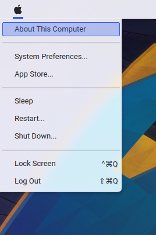
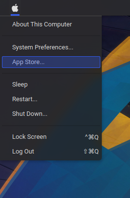

# Forked

The original maintainer does not seem actively maintaining the project anymore.
In order to port the plasmoid to KF6 I created this fork.

# Kpple Menu

<p align="center">
    
</p>

## Previews

<p align="center">
     
</p>

## How to install Kpple menu on KDE Plasma ?

[//]: # (The recommended installation method is via the KDE store.)

#### You can also use another install method ( by git ) :

Open a terminal and follow the steps below.

```bash
git clone https://github.com/chrtall/kppleMenu.git
chmod +x kppleMenu/install-plasmoid.sh
./kppleMenu/install-plasmoid.sh
```

[//]: # (## Donate)

[//]: # ()
[//]: # (If you like my projects and you want to support me, you can donate at:)

[//]: # (<span class="paypal"><a href="https://www.paypal.me/borgnietrudy" title="Donate to this project using Paypal"></a></span>)

## License

GNU GPL v2.0

